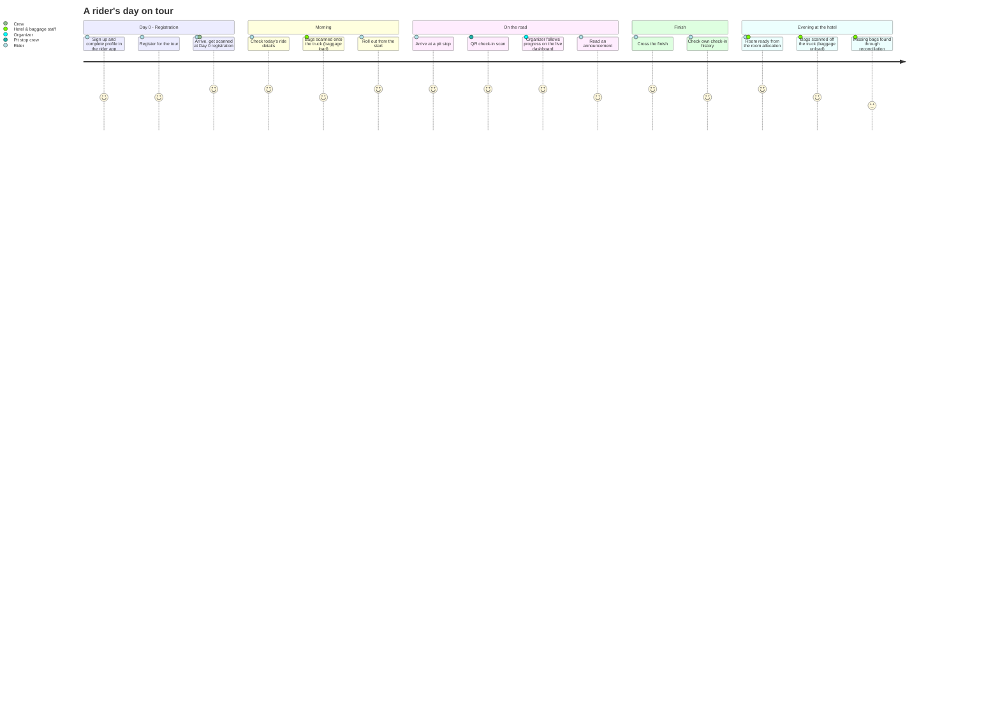
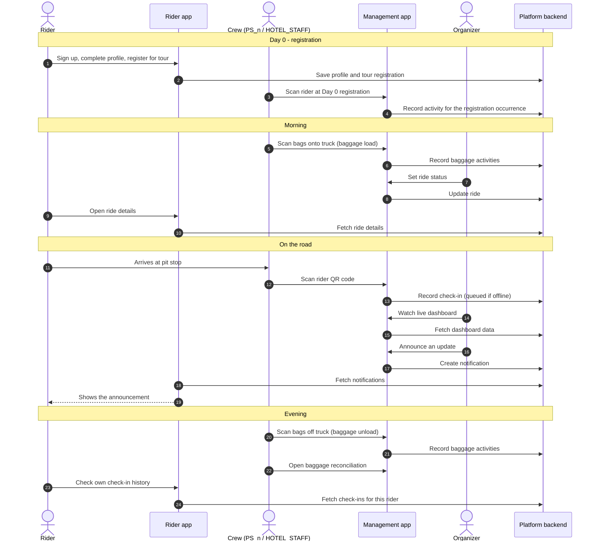

# A day on tour

This page follows a tour from the rider's point of view and shows where the platform helps at each step, from registration on **Day 0** to the evening at the hotel.

---

## The journey

The journey diagram scores each step from 1 (stressful) to 5 (delightful). It shows the rider's experience next to the crew's, stage by stage.

---

## Step by step

### :material-numeric-0-circle: Day 0: registration

Before the first ride, riders sign up in the **rider app**, complete their profile and register for the tour. On **Day 0**, the day before the first ride, riders arrive in person. The crew run the **Day 0 registration** event in the management app and scan each rider as they check in.

### :material-weather-sunset-up: Morning: bags on, riders out

The baggage crew scan every bag onto the truck (**baggage load**). The organizer sets the ride status, riders check the day's **ride details** in the rider app, and the ride starts.

### :material-map-marker-radius: On the road: pit stops

At each pit stop, the crew (`PS_1` to `PS_5`) scan riders' QR codes as they arrive. Each scan becomes a **check-in**. If there's no signal, the management app saves the scan on the phone and syncs it later. If a rider withdraws, the crew record a **rider exit**.

### :material-view-grid: At base: the live dashboard

Organizers watch the **dashboard grid** fill in as check-ins arrive. Rows are riders and columns are check-in points. Organizers can spot a rider who is falling behind and act quickly. They can send **notifications** to riders at any time.

### :material-flag-checkered: Finish

Riders reach the finish. Their check-in history in the rider app shows the whole day.

### :material-bed: Evening: hotel and baggage

Hotel staff already have the **room allocation**, which was uploaded as a CSV file. The baggage crew scan bags off the truck (**baggage unload**), and **baggage reconciliation** shows any bag that hasn't turned up.

---

## Who talks to whom

This sequence diagram shows the main exchanges during one day of the tour.

_Last updated: 2026-09-29_
