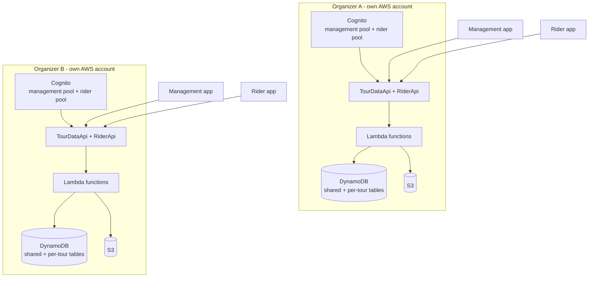
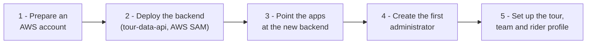

# Deployment model

**One organizer, one complete platform.** Each organizer runs the **full stack in their own AWS account**. Nothing is shared between organizers: no database, no sign-in pool and no files.

---

## What each organizer gets

The two environments are completely separate. The apps for each organizer are set up to talk to that organizer's backend.

---

## Getting an organizer set up

At a high level:

1. **Prepare an AWS account** for the organizer.
2. **Deploy the backend.** `tour-data-api` is an AWS SAM application. One deployment creates everything: both Cognito user pools, both HTTP APIs, the Lambda functions, the DynamoDB tables and S3.
3. **Connect the apps.** The management app and the rider app are configured with the new backend's API and sign-in details. The apps own no infrastructure of their own.
4. **Create the first administrator**, who can then onboard the rest of the team.
5. **Set up the tour.** Create the tour and rides, assign team members to it with their roles, and define the rider profile. Riders can then sign up and register in the rider app.

!!! tip "Step-by-step technical guide"
    The full deployment instructions are in the backend repository:
    [tour-data-api deployment guide](https://github.com/kvijay77-in/tour-data-api/blob/main/docs/guides/deployment.md)

---

## Why this model?

| | |
|---|---|
| :material-shield-lock: **Privacy** | Rider data never mixes with another organizer's data. |
| :material-account-cash: **Clear ownership and cost** | The organizer owns the account, the data and the AWS bill. |
| :material-tune: **Independence** | Each organizer's environment is managed separately from every other organizer's. |

Ideas for making it easier to serve riders across organizers, and to distribute the apps, are on the [roadmap](roadmap.md).

_Last updated: 2026-09-29_
