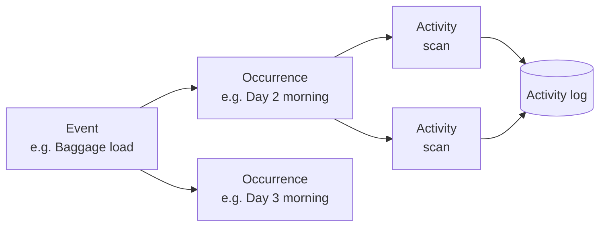

# Management app

The **management app** is used by organizers, pit stop crews, hotel and baggage staff, and guests. It runs on **Android** and in a **web browser**, where organizers can watch the dashboard on a big screen.

!!! abstract "At a glance"
    - **Who uses it:** `ADMINISTRATOR`, `SUPER_USER`, `PS_1`–`PS_5`, `HOTEL_STAFF`, `GUEST`
    - **Sign-in:** the management sign-in pool, which is separate from riders
    - **Works offline:** yes. Data is stored on the device and changes wait in a sync queue.
    - **What you see depends on your role:** each person only sees the tiles and actions their role allows.

---

## Sign in and home

Team members sign in with the account the organizer created for them. The home screen shows a set of **tiles**. Each tile opens an area of the app, and the tiles you see depend on your role and the tour you're assigned to.

!!! info "Screenshot to be added"
    **Login**: `assets/screenshots/mgmt-login.png`

!!! info "Screenshot to be added"
    **Home tiles**: `assets/screenshots/mgmt-home-tiles.png`

---

## Live dashboard

The dashboard is a **grid**: one row per rider and one column per check-in point. It fills in as check-ins arrive from the pit stops. You can zoom out to see the whole field at once. Tap a rider to open the **rider card** with that rider's details.

!!! info "Screenshot to be added"
    **Dashboard grid**: `assets/screenshots/mgmt-dashboard-grid.png`

!!! info "Screenshot to be added"
    **Dashboard grid, zoomed out**: `assets/screenshots/mgmt-dashboard-grid-zoomed-out.png`

!!! info "Screenshot to be added"
    **Rider card**: `assets/screenshots/mgmt-rider-card.png`

On a desktop the same dashboard runs in the browser, which suits a control room or a big screen at base.

!!! info "Screenshot to be added"
    **Web dashboard on desktop**: `assets/screenshots/mgmt-web-dashboard-desktop.png`

---

## QR check-in at pit stops

Pit stop crews scan each rider's QR code as they arrive. The app shows a clear **success** or **error** result, so the crew know straight away whether they need to scan again. The **check-in log** lists everyone recorded at the pit stop.

!!! info "Screenshot to be added"
    **Check-in scan, success**: `assets/screenshots/mgmt-checkin-scan-success.png`

!!! info "Screenshot to be added"
    **Check-in scan, error**: `assets/screenshots/mgmt-checkin-scan-error.png`

!!! info "Screenshot to be added"
    **Check-in log**: `assets/screenshots/mgmt-checkin-log.png`

---

## Rides and ride status

Organizers manage the **status** of each ride through the day. The ride details are in the ride tabs of tour setup.

## Tour setup

Organizers create the tour and its rides in **tour setup**, before the tour and as it goes on.

!!! info "Screenshot to be added"
    **Tour setup**: `assets/screenshots/mgmt-tour-setup.png`

!!! info "Screenshot to be added"
    **Ride tabs**: `assets/screenshots/mgmt-ride-tabs.png`

---

## Events engine

A tour involves more than riding. The **events engine** tracks the other operations, such as:

- **Day 0 registration**: riders checking in before the tour starts
- **Baggage load and unload**: bags onto the truck in the morning and off it at the hotel

Each event has **occurrences**, which are specific instances of it (for example, baggage load on a particular day). Crews record **activities** in an occurrence, usually by scanning a QR code. Every activity is kept in the **activity log**. The **occurrence dashboard** shows progress, and **baggage reconciliation** shows which bags are accounted for.

!!! info "Screenshot to be added"
    **Events home**: `assets/screenshots/mgmt-events-home.png`

!!! info "Screenshot to be added"
    **Event scan**: `assets/screenshots/mgmt-event-scan.png`

!!! info "Screenshot to be added"
    **Occurrence dashboard**: `assets/screenshots/mgmt-occurrence-dashboard.png`

!!! info "Screenshot to be added"
    **Baggage reconciliation**: `assets/screenshots/mgmt-baggage-reconciliation.png`

---

## Hotels and room allocation

Hotel staff and organizers manage the **hotels** for the tour. Room allocation, which says which rider is in which room, is **uploaded as a CSV file**, so nobody has to type it in by hand.

!!! info "Screenshot to be added"
    **Hotel management**: `assets/screenshots/mgmt-hotel-management.png`

!!! info "Screenshot to be added"
    **Hotel CSV upload**: `assets/screenshots/mgmt-hotel-csv-upload.png`

---

## Rider exit

If a rider withdraws from the tour, the team record a **rider exit**. Everyone then knows the rider is no longer expected at the next check-in points.

## Artifacts

**Artifacts** are files that belong to a tour. The backend stores them in the organizer's own storage.

---

## Notifications

Organizers can **announce** a message to riders. Riders get it as a **push** notification on their phone, and it's also kept in their **inbox** in the rider app. **Notification rules** can also send notifications automatically when something happens on the tour.

!!! info "Screenshot to be added"
    **Notification announce**: `assets/screenshots/mgmt-notification-announce.png`

---

## User management

Administrators **onboard team members** and **assign them to a tour with a role**. For example, someone could be `PS_2` on one tour and `HOTEL_STAFF` on another.

!!! info "Screenshot to be added"
    **User onboarding**: `assets/screenshots/mgmt-user-onboarding.png`

## Rider profile definitions

Organizers decide which **profile questions** riders are asked. The rider app builds its profile form from these definitions, so organizers can change the questions without releasing a new version of the app.

---

## Works offline

Pit stops are often in places with poor signal, so the management app is **offline-first**:

- Tour data is kept in a local database on the device (SQLite).
- Changes such as check-in scans go into an **outbound sync queue**.
- A banner shows when you're offline, and a **sync status** shows what is still waiting to be sent.
- When the connection comes back, the queue is sent to the backend automatically.

See [How it works: offline sync](../how-it-works.md#offline-sync-in-the-management-app) for the diagram.

!!! info "Screenshot to be added"
    **Offline banner / sync status**: `assets/screenshots/mgmt-offline-sync-status.png`

---

!!! tip "Want the step-by-step guide?"
    The management app user guide, organised by role, is in the app's repository at `docs/user-guide/README.md`. See [Resources](../resources.md).

_Last updated: 2026-09-29_
