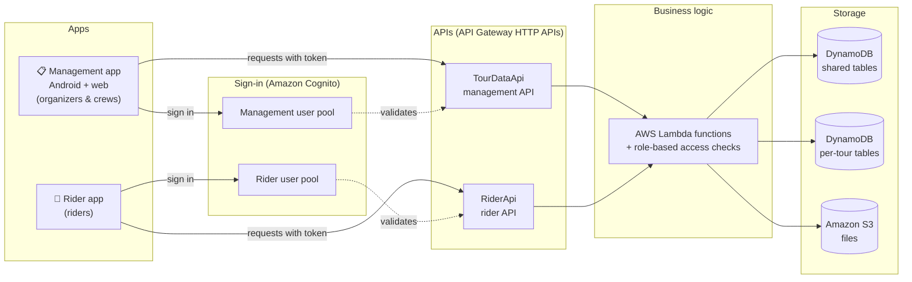
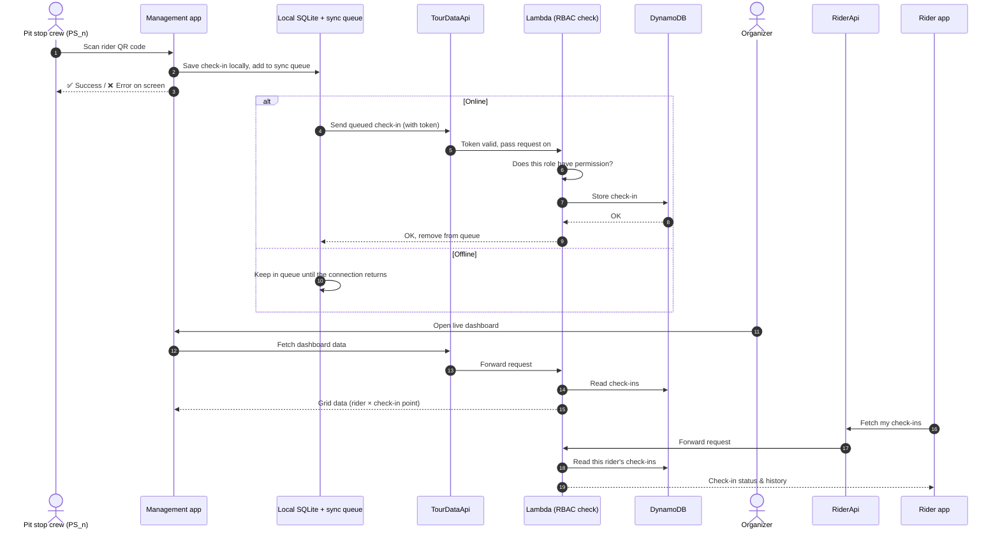
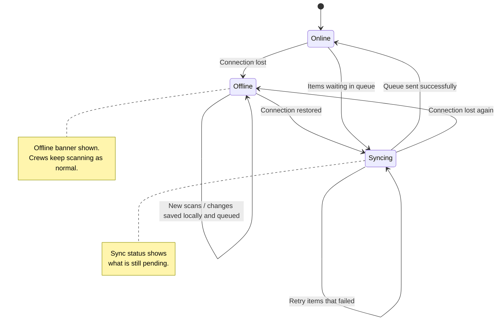
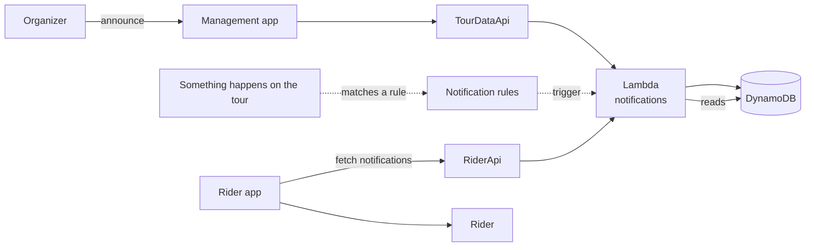

# How it works

This page explains how the platform fits together. It stays at the level of boxes and arrows. For the full technical design, see the backend repository listed in [Resources](resources.md).

---

## The big picture

There are **two apps** and **one backend**. The backend, `tour-data-api`, owns **all** of the cloud infrastructure, including sign-in, APIs, compute, databases and file storage.

**In plain words**

- Each app has its **own sign-in pool** and its **own API**. The management team and riders never share a login system.
- Every request carries a sign-in token. The API checks the token. The Lambda functions then check the **role** (for management users) before doing anything.
- Data is kept in **DynamoDB**. Some tables are shared across the platform, and each tour also gets its **own tables**. Files are kept in **S3**.

---

## Data flow for a check-in

This is what happens when a pit stop crew member scans a rider's QR code.

---

## Offline sync in the management app

Pit stops are often somewhere with a weak signal. The management app keeps a local copy of what it needs in **SQLite**, and each change it makes goes into an **outbound sync queue**. The queue is sent to the backend whenever there is a connection.

!!! note
    Only the **management app** works offline. The **rider app** needs a connection.

---

## Notification flow

Notifications reach riders in two ways:

1. **Announcements**: an organizer writes a message in the management app.
2. **Notification rules**: rules configured for the tour create notifications automatically when something happens.

---

## What lives where

| Piece | Repository | What it contains |
|---|---|---|
| Backend and **all** infrastructure | `tour-data-api` | Python AWS SAM application: APIs, Lambda functions, DynamoDB tables, S3, both Cognito user pools and the role/permission model |
| Management app | `tour-mgmt-app` | React Native / Expo app (Android and web) with offline SQLite storage and a sync queue |
| Rider app | `tour-rider-app` | React Native / Expo app for riders |
| This site | `cycling-tour-platform` | The platform overview and the platform glossary |

_Last updated: 2026-09-29_
