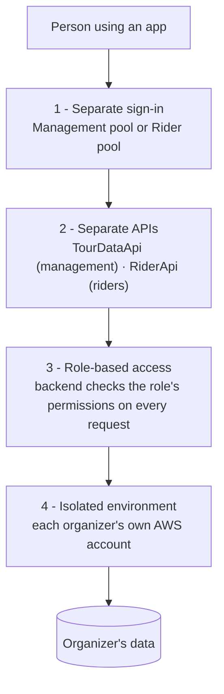

# Security & privacy

A tour holds personal information: riders' names, profiles, where they are on the road and where they're sleeping tonight. The platform is designed so that only the right people can see or change each piece of it, and so that the data belongs to the organizer.

---

## Four layers of protection

### 1. Separate sign-in for the team and for riders

There are **two separate Amazon Cognito user pools**:

| Pool | Who is in it | Used by |
|---|---|---|
| **Management pool** | Organizers, pit stop crews, hotel staff, guests | Management app |
| **Rider pool** | Riders | Rider app |

A rider account can't sign in to the management app, and a team account isn't a rider account. Both pools are created and managed by the backend (`tour-data-api`).

### 2. Separate APIs

Each app talks to **its own API**. The management app uses `TourDataApi` and the rider app uses `RiderApi`. Each API only accepts tokens from its own sign-in pool, so riders only reach the functions built for riders.

### 3. Role-based access control

Every management user is given a **role** on a tour. The backend defines what each role may do (in `src/layers/common/rbac.py`) and checks it on **every request**. The apps hide actions a role can't use, but the **backend is what enforces the rules**.

| Role | In plain words |
|---|---|
| `ADMINISTRATOR` | Runs the platform for the organizer: tours, users and settings |
| `SUPER_USER` | Runs tour operations with broad access |
| `PS_1` … `PS_5` | Pit stop crew for pit stops 1 to 5: check-ins and pit stop tasks |
| `HOTEL_STAFF` | Hotels, room allocation and baggage |
| `GUEST` | Observer with restricted access |

!!! info "The backend is the source of truth"
    The exact permissions for each role are defined only in the backend. This table describes the roles in general terms. If it ever disagrees with `rbac.py`, `rbac.py` is correct.

Team members are linked to a tour through a **tour user assignment**, so a person can have different roles on different tours.

### 4. Each organizer has an isolated environment

Each organizer runs the **whole platform in their own AWS account**. There's no shared database and no shared sign-in, so one organizer's riders and data can never be seen by another organizer. See the [deployment model](deployment-model.md).

---

## Data ownership

- **The organizer owns the data.** Rider profiles, check-ins, hotel allocations, artifacts and notifications all stay in the organizer's own AWS account.
- **No data is shared across organizers.** Every deployment is independent.
- **The organizer decides what to collect.** Rider profile questions come from the organizer's own rider profile definitions.
- **Riders see their own information.** The rider app shows a rider their own profile, registrations, check-ins and notifications.

_Last updated: 2026-09-29_
