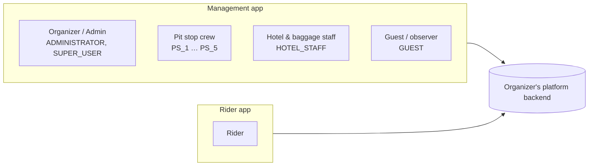

# Who it's for

Many different people make a cycling tour happen, and each of them needs something different from the platform. This page introduces them.

!!! info "Roles are defined by the backend"
    The role names below (`ADMINISTRATOR`, `SUPER_USER`, `PS_1`–`PS_5`, `HOTEL_STAFF`, `GUEST`) are the ones defined in the backend (`tour-data-api`, `src/layers/common/rbac.py`). The backend decides what each role is allowed to do. The apps only show what the backend permits.

---

## :material-account-tie: Organizer / Admin

**Roles:** `ADMINISTRATOR`, `SUPER_USER`

> "I need to know where every rider is, and I need the tour set up correctly before anyone turns up."

**What they need**

- To set up the tour, its rides and its pit stops
- To add team members and give each person the right role
- To follow the whole field live on ride day
- To send announcements to riders
- To manage hotels, room allocation and baggage without piles of spreadsheets

**How the platform helps**

- **Tour setup** covers the tour, its rides and the ride status.
- **User management** onboards team members and assigns them to a tour with a role.
- The **live dashboard grid** shows every rider against every pit stop. It works on a phone, and on a desktop browser through the web version of the app.
- **Notifications** let organizers announce updates, and **notification rules** send messages automatically.
- The **events engine** runs Day 0 registration, baggage load and unload, and other activities.
- **Hotels** can be set up and **room allocations** uploaded from a CSV file.
- **Rider profile definitions** set the profile questions riders answer in the rider app.
- **Artifacts** are the files attached to the tour.

---

## :material-map-marker-radius: Pit stop crew

**Roles:** `PS_1`, `PS_2`, `PS_3`, `PS_4`, `PS_5`, one for each pit stop

> "Riders are arriving in bunches, my hands are sticky, and there's one bar of signal. Scanning has to *just work*."

**What they need**

- Fast, reliable check-in of each rider arriving at their pit stop
- To know straight away whether a scan worked or failed
- To keep working when there's no mobile signal
- To record a rider leaving the tour

**How the platform helps**

- **QR check-in scanning** gives a clear success or error result on screen.
- The **check-in log** lists everyone scanned at the pit stop.
- **Offline-first operation**: scans are saved on the phone and synced automatically.
- **Rider exit** records a rider withdrawing from the tour.

---

## :material-bed: Hotel & baggage staff

**Role:** `HOTEL_STAFF`

> "Every bag has to reach the right hotel, and every rider needs a room to go to."

**What they need**

- To see hotels and room allocation for each night
- To scan bags onto the truck in the morning and off it in the evening
- To find missing bags quickly

**How the platform helps**

- **Hotel management** shows hotels and room allocations.
- **Baggage load and unload** events are scanned in the events engine.
- **Baggage reconciliation** shows which bags are accounted for and which are still missing.

---

## :material-eye: Guest / observer

**Role:** `GUEST`

> "I'd like to follow how the tour is going without the risk of changing anything."

**What they need**

- To see progress without being able to change data

**How the platform helps**

- The `GUEST` role gives restricted, observer-level access through the management app. The backend decides exactly what a guest can see.

---

## :material-bike: Rider

**Uses:** the **rider app**, with a separate rider sign-in

> "Tell me what today's ride looks like, confirm I've been checked in, and let me know if anything changes."

**What they need**

- To sign up, create a profile and register for a tour
- To see the ride details for the day
- To check their own check-in status and history
- To receive announcements from the organizers
- Something to keep them motivated before the tour

**How the platform helps**

- **Sign-up** and a **dynamic profile** built from the questions the organizer defines
- **Tour browsing and registration**
- A **tour dashboard** and **ride details**
- **Check-in status and history**
- **Notifications**
- A **training challenge**

!!! note "The rider app needs a connection"
    The rider app has no offline mode. Offline working is a feature of the management app, which crews use in areas with poor signal.

_Last updated: 2026-09-29_
